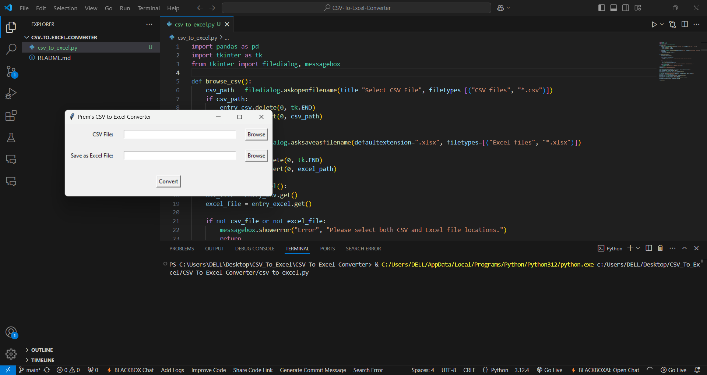
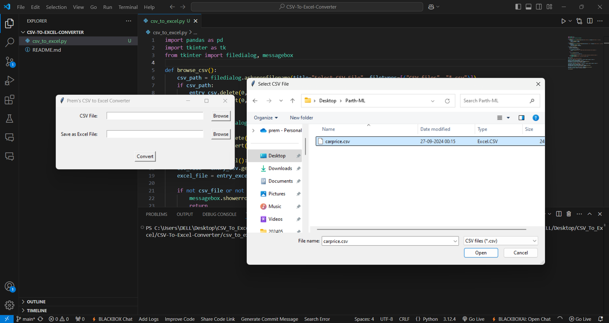
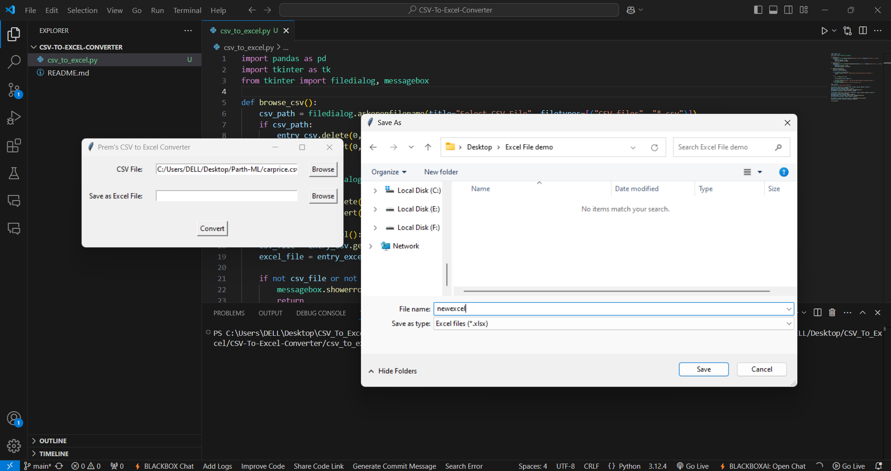
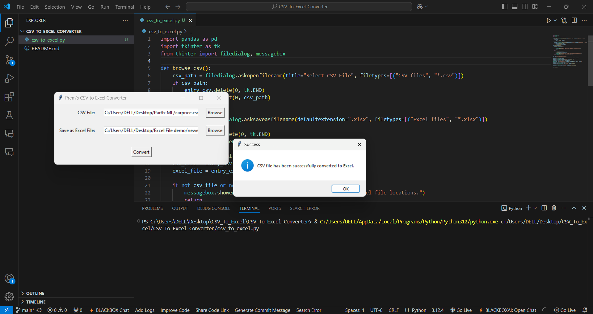

# CSV to Excel Converter

## Overview

The **CSV to Excel Converter** is a Python-based tool that allows users to easily convert CSV files into Excel files (.xlsx) with a graphical user interface (GUI). This project uses the `pandas` library for reading and writing CSV and Excel files and `tkinter` for creating the GUI. It is a simple, user-friendly solution for batch processing CSV data and saving it in Excel format.

## Features
- Easy-to-use graphical interface with `tkinter`.
- Converts CSV files to Excel format with just a few clicks.
- Supports user-defined output locations for Excel files.
- Does not include the row index when saving to Excel (`index=False`).

## Requirements

Before running the application, make sure you have the following installed:

- **Python** (version 3.x)
- **pandas** (for reading and writing CSV and Excel files)
- **openpyxl** (for writing Excel files)

You can install the required dependencies using `pip`:

```bash
pip install pandas openpyxl
```

## Installation

1. Clone the repository:

```bash
git clone https://github.com/soypremshandilya/CSV-To-Excel-Converter.git
```

2. Navigate to the project directory:

```bash
cd CSV-To-Excel-Converter
```

3. Ensure the required libraries are installed:

```bash
pip install pandas openpyxl
```

4. Run the application:

```bash
python csv_to_excel.py
```

## Usage

1. Launch the program by running `csv_to_excel.py`.
2. The GUI will open with two fields:
   - **CSV File**: Click "Browse" to select the input CSV file.
   - **Save as Excel File**: Click "Browse" to select the location to save the output Excel file.
3. After selecting the files, click the "Convert" button to convert the CSV file to Excel format.
4. A success message will appear once the conversion is complete.

## File Structure

```
CSV-To-Excel-Converter/
│
├── csv_to_excel.py      # Main Python script for CSV to Excel conversion
├── README.md            # This README file
└── requirements.txt     # List of required dependencies (optional)
```
---

## Screenshots


Example:
- **Select the CSV file, which you want to convert**  

**Give path to the CSV File or Choose the file directly**

**Choose the location, where you want the new Excel file to be saved.**

**Saved Excel File**



---

## Contributing

Contributions are welcome! If you have suggestions for improvements or have encountered any issues, feel free to fork the repository, create a branch, and submit a pull request.

## Contact

- GitHub Repository: [https://github.com/soypremshandilya/CSV-To-Excel-Converter](https://github.com/soypremshandilya/CSV-To-Excel-Converter)
- GitHub Username: [@soypremshandilya](https://github.com/soypremshandilya)

## Acknowledgements

- `pandas` for handling CSV and Excel files.
- `tkinter` for creating the GUI.
- `openpyxl` for writing Excel files in `.xlsx` format.

```

### Explanation:

- **Overview**: Provides a brief description of the project and its main purpose.
- **Features**: Highlights the key features of the tool.
- **Requirements**: Lists the dependencies and how to install them.
- **Installation**: Explains the steps to clone and run the project.
- **Usage**: Guides the user on how to use the program with step-by-step instructions.
- **File Structure**: Displays the directory structure of the project for clarity.
- **License**: Includes information about the project's license (MIT in this case).
- **Contributing**: Encourages contributions and provides instructions for contributing.
- **Contact**: Provides the link to the GitHub repository and your GitHub username.
- **Acknowledgements**: Credits the libraries used in the project.

Feel free to modify or expand this README as necessary based on your specific requirements.
